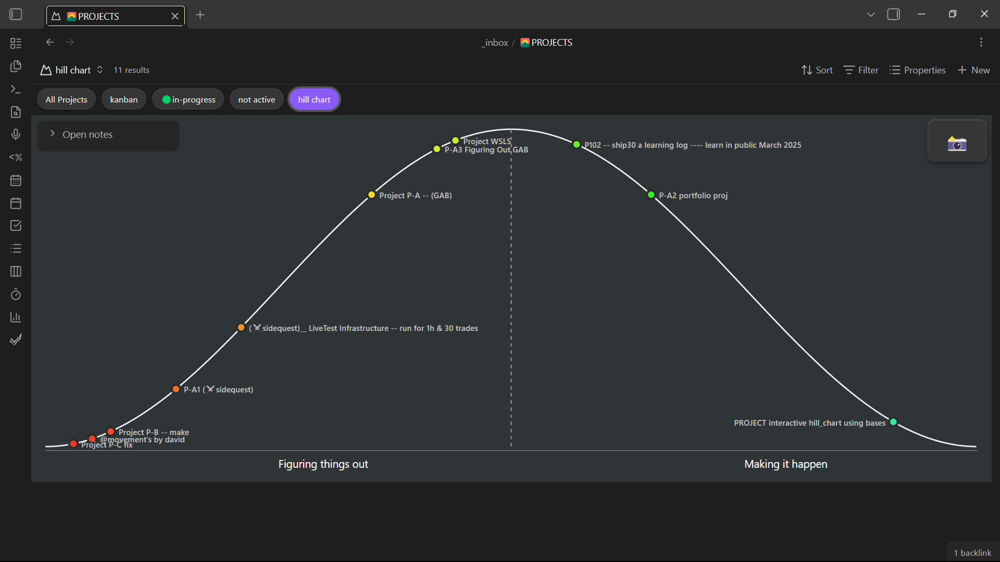
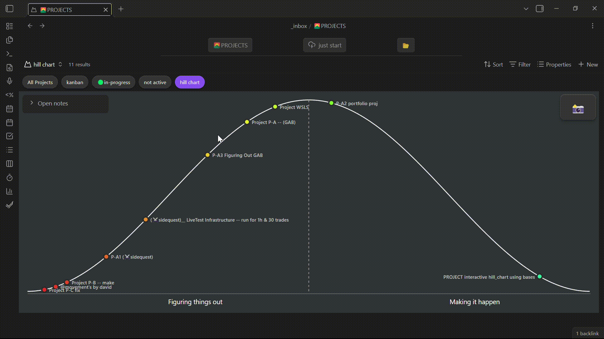
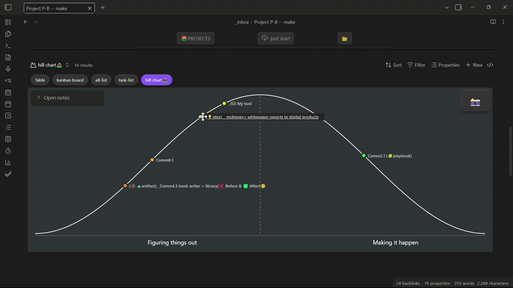

# Obsidian Hill Charts (Bases View)

An **interactive Hill Chart view for Obsidian Bases** Inspired by basecamp.
Visualize project progress directly from your Base using draggable dots that stay in sync with note frontmatter.

This plugin implements a **custom Bases view** that renders a hill-shaped progress curve and maps each file’s `hillPos` property to a position on the hill.
**To use add the hillPos property to a note** 
Example:

---
hillPos: 42
---

---

---

---

## Features

* ✅ Custom **Bases View** (not a hack or embed)
* ✅ Reads `hillPos` directly from Base query results
* ✅ Drag dots to update note frontmatter (`hillPos`)
* ✅ Dark-mode optimized visuals

---

## Requirements

* Obsidian **v1.10.0+**
* Core **Bases** plugin enabled
* Notes must have a numeric frontmatter property (default: `hillPos`)

## Known limitations

* No mobile-specific optimizations yet

## License

MIT
